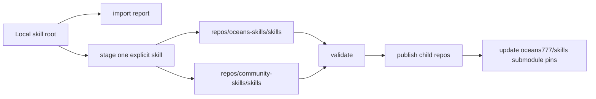

# oceans777 Skill Publishing Design

## 背景

`oceans777/skills` 已经是入口仓库，负责 clone 后初始化子仓库、验证结构、安装 skill，并保护用户本地已有 skill 不被覆盖。现在缺少的是安全、可重复的“上传本地 skill 到 GitHub 子仓库”的流程。

这个流程不能只是复制目录并提交。skill 会被完全开源，里面可能包含本机路径、token、私有提示词、第三方授权不清晰的内容，或者和另一个仓库里的 skill 同名。因此上传逻辑必须先审计、再明确分类、再 staging、再发布。

## 目标

新增程序化发布流程，让维护者可以在任意电脑上把本地 skill 安全地放入 oceans777 组织仓库：

```powershell
.\oceans.ps1 import
.\oceans.ps1 stage -SourceRoot "$HOME\.codex\skills" -Skill frontend-design -Target oceans
.\oceans.ps1 publish
```

POSIX shell 对应命令：

```sh
./oceans import
./oceans stage --source-root "$HOME/.codex/skills" --skill frontend-design --target oceans
./oceans publish
```

最终其他用户或另一台电脑只需要：

```sh
git clone https://github.com/oceans777/skills.git
cd skills
./setup.sh
```

Windows 用户使用：

```powershell
git clone https://github.com/oceans777/skills.git
cd skills
.\setup.ps1
```

## 非目标

第一版不做自动批量上传全部本地 skill。必须显式指定 skill 名称和目标仓库。

第一版不自动修复风险内容。脚本只报告风险并阻止 staging，维护者人工清理后重试；确实需要保留时用显式 override。

第一版不替维护者判断第三方授权是否合法。`community-skills` 必须有真实的 upstream、patch、license 记录；缺少这些记录时 `stage` 必须失败，而不是生成空模板放行。

## 命令模型

入口命令新增两个子命令：

```text
stage
publish
```

`stage` 只复制一个本地 skill 到目标子仓库的工作树，不提交、不推送。

`publish` 验证两个子仓库，提交并推送有变化的子仓库，然后回到入口仓库更新 submodule 指针并提交推送。

这两个命令是维护者命令，不是普通安装命令。普通用户只需要 `setup`、`sync`、`install`；维护者在发布前必须让两个子仓库处于本地 `main` 分支，而不是 detached HEAD。

PowerShell 参数：

```powershell
.\oceans.ps1 stage -SourceRoot "$HOME\.codex\skills" -Skill frontend-design -Target oceans
.\oceans.ps1 stage -SourceRoot "$HOME\.agents\skills" -Skill discuz-x5 -Target oceans
.\oceans.ps1 stage -SourceRoot "$HOME\.codex\skills" -Skill adapted-skill -Target community -UpstreamUrl "https://github.com/example/adapted-skill" -UpstreamAuthor "Example Author" -UpstreamLicense MIT -LicenseFile "C:\path\to\LICENSE"
.\oceans.ps1 publish
```

POSIX 参数：

```sh
./oceans stage --source-root "$HOME/.codex/skills" --skill frontend-design --target oceans
./oceans stage --source-root "$HOME/.agents/skills" --skill discuz-x5 --target oceans
./oceans stage --source-root "$HOME/.codex/skills" --skill adapted-skill --target community --upstream-url "https://github.com/example/adapted-skill" --upstream-author "Example Author" --upstream-license MIT --license-file "/path/to/LICENSE"
./oceans publish
```

## Stage 规则

`stage` 的输入：

```text
SourceRoot / --source-root: 本地 skill 根目录，默认 CODEX_HOME/skills 或 ~/.codex/skills
Skill / --skill: 单个 skill 文件夹名
Target / --target: oceans 或 community
AllowRisk / --allow-risk: 默认 false
ReplaceExisting / --replace-existing: 默认 false
DryRun / --dry-run: 默认 false，只打印将要执行的复制和检查，不写入
UpstreamUrl / --upstream-url: community 目标必需，除非源 skill 已经带有完整 UPSTREAM.md
UpstreamAuthor / --upstream-author: community 目标必需，除非源 skill 已经带有完整 UPSTREAM.md
UpstreamLicense / --upstream-license: community 目标必需，除非源 skill 已经带有完整 UPSTREAM.md
LicenseFile / --license-file: community 目标必需，除非源 skill 已经带有 LICENSE
PatchSummary / --patch-summary: community 目标建议提供；未提供时 PATCHES.md 必须明确写 no local changes
```

community attribution 的最低结构：

```text
UPSTREAM.md: original repository URL, original author, upstream license name, import date
PATCHES.md: local changes summary, or the exact sentence "No local changes."
LICENSE: upstream license text copied from LicenseFile or already present in the source skill
```

`stage` 的检查顺序：

1. 验证 source root 存在。
2. 验证 skill 名称只包含小写字母、数字、连字符。
3. 拒绝 `.system`。
4. 验证目标子仓库存在，并且当前分支是 `main`，不是 detached HEAD。
5. 验证目标子仓库没有 `skills/` 之外的未提交改动；已有 staged skill 改动可以保留，便于连续 stage 多个 skill。
6. 验证源 skill 目录存在。
7. 验证源 skill 有顶层 `SKILL.md`。
8. 扫描 secret-like 文本和本地绝对路径。
9. 如果发现风险且没有 `AllowRisk` / `--allow-risk`，失败并打印具体风险。
10. 检查 `repos/oceans-skills/skills/<skill>` 和 `repos/community-skills/skills/<skill>` 是否已有同名目录。
11. 如果目标仓库已有同名目录且没有 `ReplaceExisting` / `--replace-existing`，失败。
12. 如果非目标仓库已有同名目录，即使设置了 replace，也失败；跨仓库迁移必须人工处理。
13. 解析目标路径为绝对路径，确认它位于目标仓库的 `skills/` 目录内；任何删除或覆盖只能发生在这个已验证路径内。
14. 如果是 dry run，打印计划并退出，不复制。
15. 复制目录到目标子仓库，排除 `.git`、`.oceans-skill-source`、`.DS_Store`、`Thumbs.db`、临时缓存目录。
16. 再次扫描复制后的目标目录，确认 marker 和排除项没有进入仓库。
17. 如果目标是 community，确保 `UPSTREAM.md`、`PATCHES.md`、`LICENSE` 有真实内容。源目录已有完整文件时保留；否则必须由命令参数生成 `UPSTREAM.md` 和 `PATCHES.md`，并从 `LicenseFile` 复制真实 license 文本到 `LICENSE`。
18. 无法扫描的二进制或不可读文件默认阻止 staging，除非显式 `AllowRisk` / `--allow-risk`。
19. 超过 1MB 的文件默认阻止 staging，除非显式 `AllowRisk` / `--allow-risk`。

`stage` 的输出必须清楚说明：

```text
staged-skill: <name>
target_repository: oceans-skills 或 community-skills
target_path: <path>
risk_status: none detected 或 blocked
dry_run: true 或 false
next: run validate, then publish
```

## Publish 规则

`publish` 的执行顺序：

1. 确认入口仓库工作树没有 `repos/oceans-skills` 和 `repos/community-skills` 之外的未提交改动；子仓库里的 staged skill 改动允许存在。
2. 确认入口仓库和两个子仓库当前分支都是 `main`，并且有可用 remote。
3. 对入口仓库和两个子仓库执行 fetch，确认本地分支没有落后远端；如果落后，失败并提示先运行 sync。
4. 在两个子仓库运行 status。
5. 运行 PowerShell 或 shell 版 `validate-skills`，取决于当前平台入口。
6. 如果是 dry run，只打印将提交和推送的仓库，不提交、不推送。
7. 对有变化的 `repos/oceans-skills` 提交：`skills: publish staged first-party skills`。
8. 对有变化的 `repos/community-skills` 提交：`skills: publish staged community skills`。
9. 推送有变化的子仓库，使用普通 fast-forward push，禁止 force push。
10. 回到入口仓库，检测 submodule 指针变化。
11. 提交入口仓库：`repos: update skill submodules`。
12. 推送入口仓库，使用普通 fast-forward push，禁止 force push。

如果任何一步失败，后续步骤停止，不做回滚。Git 工作树保留现场，维护者可以检查并继续。

所有 Git fetch、pull、push 操作都复用现有 `scripts/common.ps1` 和 `scripts/common.sh` 里的 retry helper，避免 publish 比 setup/sync 更脆弱。

## 安全策略

默认不上传任何 skill。维护者必须显式指定 skill 和 target。

默认不覆盖已有仓库 skill。覆盖必须显式使用 `ReplaceExisting` / `--replace-existing`。

默认不允许风险内容。风险包括：

```text
api_key、secret、token、password、authorization bearer、sk- 开头的疑似 key
/Users/、/home/、C:\Users\、/private/ 等本地绝对路径
超过 1MB 的大文件
无法读取或无法扫描的二进制文件
```

默认不上传 `.system`。

默认不发布缺少 `SKILL.md` 的目录。

默认不发布跨仓库同名 skill。`validate` 已经负责拒绝这种情况，`stage` 也必须提前检查。

默认不发布第三方来源不清晰的 community skill。community skill 没有真实 `UPSTREAM.md`、`PATCHES.md`、`LICENSE` 时必须失败。

默认不执行 force push。所有 publish 推送都必须是普通 fast-forward push。

## 文件边界

新增脚本：

```text
scripts/stage-skill.ps1
scripts/stage-skill.sh
scripts/publish-skills.ps1
scripts/publish-skills.sh
```

修改入口：

```text
oceans.ps1
oceans
README.md
docs/commands.md
```

测试：

```text
scripts/test-stage-skill.ps1
scripts/test-stage-skill.sh
scripts/test-publish-skills.ps1
scripts/test-publish-skills.sh
```

## 数据流



## 测试策略

测试必须使用临时目录和临时 Git 仓库，不写真实 `repos/oceans-skills` 或 `repos/community-skills`，也不写真实 `~/.codex/skills`。

`stage` 测试覆盖：

```text
成功 staging first-party skill
成功 staging community skill 并写入真实 attribution 文件
拒绝 community skill 缺少 upstream/license 真实输入
拒绝 .system
拒绝缺少 SKILL.md
拒绝 secret-like 内容
拒绝 local absolute path
拒绝无法扫描的二进制或不可读文件，除非显式 AllowRisk / --allow-risk
拒绝超过 1MB 的大文件，除非显式 AllowRisk / --allow-risk
拒绝目标子仓库不是 main 分支或处于 detached HEAD
拒绝目标子仓库在 skills/ 外有未提交改动
拒绝跨仓库同名
拒绝覆盖已有 skill，除非显式 ReplaceExisting / --replace-existing
拒绝跨仓库迁移，即使显式 ReplaceExisting / --replace-existing
复制时移除 .oceans-skill-source marker
dry run 不写目标目录
```

`publish` 测试覆盖：

```text
无子仓库变化时不提交
有 first-party 变化时只提交 first-party 子仓库并更新入口 submodule
有 community 变化时只提交 community 子仓库并更新入口 submodule
validate 失败时停止，不提交不推送
入口仓库有无关未提交改动时停止
入口仓库只有子仓库 staged skill 改动时允许继续
本地分支落后远端时停止
dry run 不提交不推送
```

PowerShell 和 POSIX shell 实现必须共享同一组行为契约。每个测试夹具都要同时跑 `.ps1` 和 `.sh` 版本，避免两个平台的发布逻辑漂移。

网络推送测试不在单元测试里真实连接 GitHub。脚本内部应把 Git 命令集中在小函数里，测试可用本地 bare repo 作为 remote。

## 成功标准

维护者可以在 Windows、Ubuntu、macOS 上用相同流程上传单个 skill。

上传流程不会误覆盖仓库已有 skill。

上传流程不会默认发布有风险内容的 skill。

发布后，其他用户只 clone `oceans777/skills` 并运行 setup，就能同步到最新已发布 skill。

## 决策

采用显式单 skill staging，而不是全量自动上传。原因是它更适合开源发布：每次只处理一个清晰对象，审计结果和 Git diff 都容易 review。

采用 `stage` 和 `publish` 分离，而不是一个 `upload` 一步到位。原因是公开发布前需要给维护者检查工作树 diff 的机会。

保留 `import` 为 report-only。原因是 import 是发现和分类工具，不应该承担写入和发布职责。
